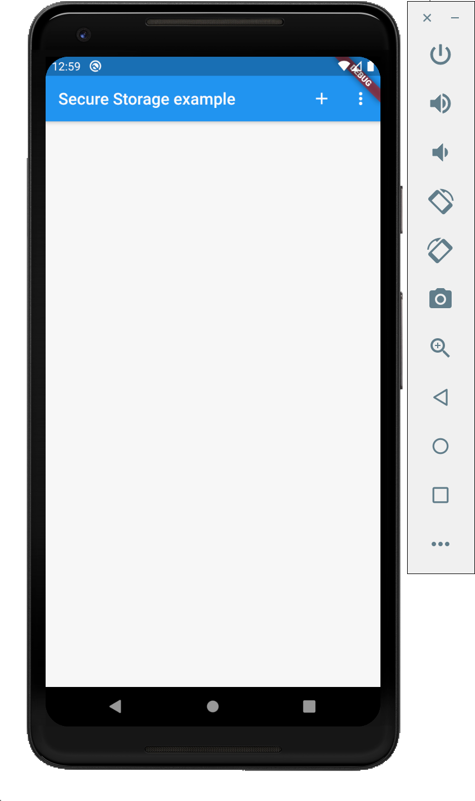
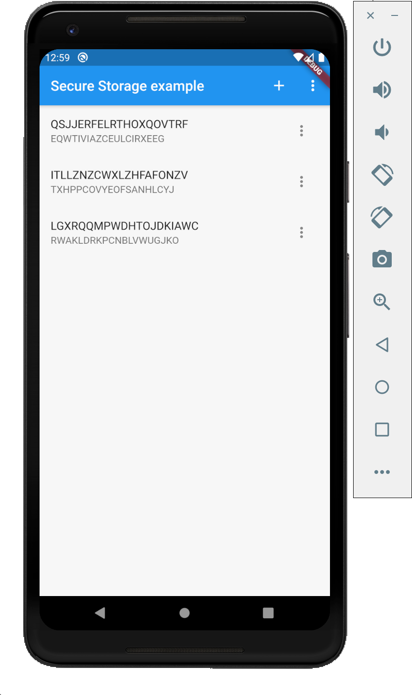

# flutter_secure_storage

A example implementation of the ```flutter_secure_storage``` package.

https://pub.dev/packages/flutter_secure_storage

## Screenshot

<table style="{border:none}">
<tr><td>

</td><td>

</td></tr></table>

## How to use the package

A Flutter plugin to store data in secure storage:
* [Keychain](https://developer.apple.com/library/content/documentation/Security/Conceptual/keychainServConcepts/01introduction/introduction.html#//apple_ref/doc/uid/TP30000897-CH203-TP1) is used for iOS 
* AES encryption is used for Android. AES secret key is encrypted with RSA and RSA key is stored in [KeyStore](https://developer.android.com/training/articles/keystore.html)

*Note* KeyStore was introduced in Android 4.3 (API level 18). The plugin wouldn't work for earlier versions.

- *Add new items*
```dart
void _addNewItem() async {
    final String key = _randomValue();
    final String value = _randomValue();

    await _storage.write(key: key, value: value);
    _readAll();
}

```

- *Delete all entries*
```dart
void _deleteAll() async {
    await _storage.deleteAll();
    _readAll();
}

```

- *Deleting or Modying existing data*
```dart
Future<Null> _performAction(_ItemActions action, _SecItem item) async {
    switch (action) {
    case _ItemActions.delete:
        await _storage.delete(key: item.key);
        _readAll();

        break;
    case _ItemActions.edit:
        final result = await showDialog<String>(
            context: context,
            builder: (context) => _EditItemWidget(item.value));
        if (result != null) {
        await _storage.write(key: item.key, value: result);
        _readAll();
        }
        break;
    }
}

```